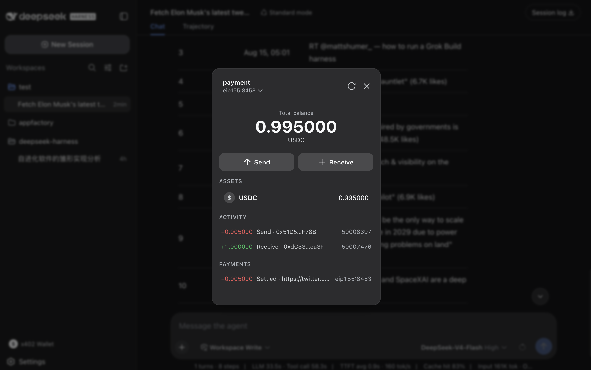

<p align="center">
  
</p>

# dsh-x402-wallet

**A visual x402 payment wallet for [DeepSeek Harness](https://github.com/deepseek-ai/deepseek-harness).** Install one bundle and your agent can discover paid APIs, estimate their cost, and pay-and-call them over the [x402](https://www.x402.org/) protocol — while a Phantom-style wallet popup gives you multi-wallet custody, QR receive, USDC send, and on-chain activity, all inside the DSH web GUI.

```sh
dsh plugin --profile web add @danielng23/dsh-x402-wallet
```

Restart `dsh web` — the **x402 钱包** entry appears in the sidebar.



## What it is

- **Your agent can pay for APIs.** Four model tools (`x402_discover`, `x402_estimate`, `x402_balance`, `x402_pay`) discover x402-enabled APIs, probe their price without paying, and pay-and-call them with a spend cap and your approval.
- **Your wallet is a first-class GUI surface.** A Phantom-style popup manages several wallets (create/import/switch), shows the USDC balance, a QR receive screen, an on-chain transfer history, and a send form — no CLI, no extension, no separate browser.
- **Keys never leave your machine.** Private keys live only in the Host credential store; the model, the logs, and the browser page never see them.

## How x402 payments work

The wallet speaks the x402 protocol natively with the **exact (EIP-3009) scheme**: the wallet signs a transfer authorization and the gateway settles on-chain, so the wallet pays **no gas**. Every paid call enforces `maxCostUsdc` (abort before signing when the cost exceeds the cap) and asks for your approval with the exact amount first.

Two different transfers, one wallet:

| What | How it works | Gas |
|---|---|---|
| Agent calls a paid API | Model runs `x402_pay` → probe → cap → approval → EIP-3009 signature → gateway settles | none (paid by the API provider's gateway) |
| You move funds out of the wallet | Popup **发送** → plain on-chain ERC-20 transfer (viem, awaited receipt) | yes (normal network gas) |

## Install

Published on the npm registry (any DSH installation):

```sh
dsh plugin --profile web add @danielng23/dsh-x402-wallet
```

From this checkout (development):

```sh
# resolves the host and UI packages from the registry; `pnpm` must be on PATH
dsh plugin --profile web add file:/absolute/path/to/dsh-x402-wallet/packages/bundle
```

To undo: `dsh plugin --profile web remove @danielng23/dsh-x402-wallet`. The wallet is **opt-in** — the shipped DSH web profile does not include it.

## Wallet setup

1. Open the wallet popup and **创建钱包** (generate or import a private key), or keep the legacy single-key credential `X402_PRIVATE_KEY`.
2. Fund the selected wallet with a few USDC on Base — the receive screen shows the address and a QR code.
3. Ask the agent for a task that needs a paid API; the approval prompt shows the exact amount and recipient before anything is signed.

## Repository layout

```
packages/host/     @danielng23/dsh-x402             host service + tools + /remote
packages/ui/       @danielng23/dsh-client-ui-x402   browser GUI (dsh.client manifest)
packages/bundle/   @danielng23/dsh-x402-wallet      installable patch layer
```

## Ecosystem position

- Built on the [DeepSeek Harness](https://github.com/deepseek-ai/deepseek-harness) plugin system — everything is a plugin; this bundle is two rows in a `cordis.yml` patch layer.
- Speaks the [x402](https://www.x402.org/) payment protocol (exact / EIP-3009) against the public [x402 catalog](https://x402mcp.app/catalog.json).
- The same packages live upstream in the DSH monorepo (`packages/x402/x402`, `packages/client/ui-x402`) and ship here as a standalone, installable distribution.

## Publish (maintainers)

The three packages publish in dependency order, host → ui → bundle:

```sh
# bump each version first (e.g. npm version patch), then:
npm publish ./packages/host
npm publish ./packages/ui
npm publish ./packages/bundle
```

`packages/host` and `packages/ui` ship their built `lib/` (the `/remote` typert artifacts included). Rebuilding from source requires the DSH repository's typert generator; build there and copy `lib/` back, or keep the committed artifacts. Publishing requires npm two-factor authentication (recovery code or authenticator).

## Security stance

- The wallet moves **real money on a real network**. Treat it like shell access with a budget.
- Keep `approvalRequired` true (the default) in any deployment that touches real funds.
- A key exposure costs only the dedicated spending float.
- Peer dependencies (`@deepseek-ai/dsh-*`, `@deepseek-ai/cordis`) resolve from the DSH installation; only the non-DSH dependencies (`@x402/*`, `viem`, `schemastery`, `zod`, `react-qr-code`) are fetched from npm.

## License

MIT
