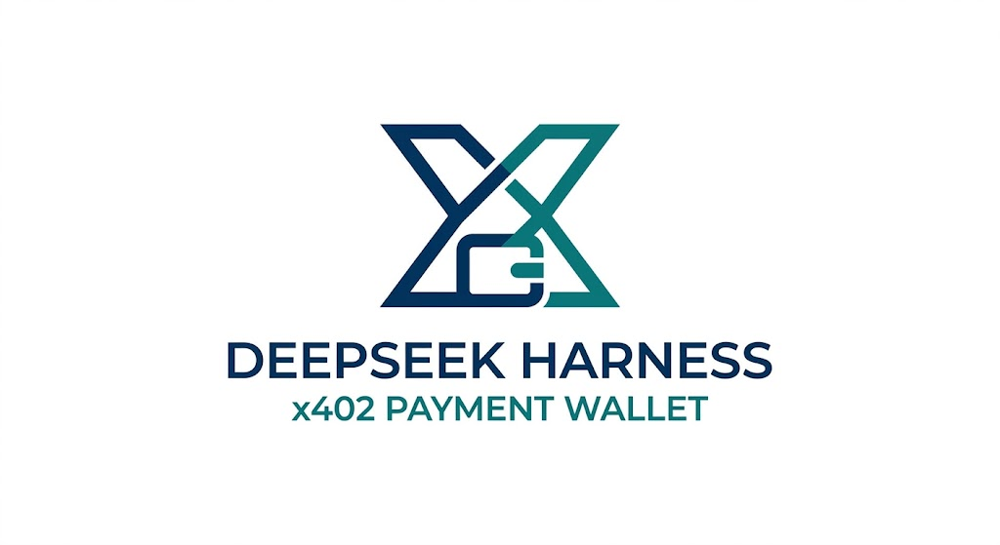

<p align="center">
  
</p>

# dsh-x402-wallet

[English](README.md) | 中文

**给 [DeepSeek Harness](https://github.com/deepseek-ai/deepseek-harness) 的可视化 x402 支付钱包。** 安装一个 bundle，你的 Agent 就能通过 [x402](https://www.x402.org/) 协议发现付费 API、估算价格并支付调用——同时一个 Phantom 风格的钱包弹窗在 DSH Web GUI 里为你提供多钱包托管、二维码收款、USDC 转出与链上活动。

```sh
dsh plugin --profile web add @danielng23/dsh-x402-wallet
```

重启 `dsh web`——侧边栏出现 **x402 钱包** 入口。


## 它是什么

- **你的 Agent 可以为 API 付费。** 四个模型工具（`x402_discover`、`x402_estimate`、`x402_balance`、`x402_pay`）发现支持 x402 的 API、不花钱探测价格，并在支出上限与你的审批下支付并调用。
- **你的钱包是一等的 GUI 表面。** Phantom 风格弹窗管理多个钱包（创建/导入/切换）、展示 USDC 余额、二维码收款屏、链上转账历史与转出表单——不需要 CLI、扩展或单独的浏览器。
- **密钥绝不离开你的机器。** 私钥只存放在 Host 凭据存储中；模型、日志与浏览器页面永远看不到它们。

## x402 支付如何工作

钱包原生使用 x402 协议的 **exact（EIP-3009）scheme**：钱包签署转账授权，网关在链上结算，因此钱包**不付 gas**。每笔付费调用强制执行 `maxCostUsdc`（成本超上限时在签名前中止），并先以确切金额请求你的审批。

同一种转账，两种路径：

| 场景 | 工作方式 | Gas |
|---|---|---|
| Agent 调用付费 API | 模型执行 `x402_pay` → 探测 → 上限 → 审批 → EIP-3009 签名 → 网关结算 | 无（由 API 提供方的网关承担） |
| 你把资金转出钱包 | 弹窗 **发送** → 普通链上 ERC-20 转账（viem，等待回执） | 有（正常网络 gas） |

## 安装

已发布到 npm registry（任意 DSH 安装）：

```sh
dsh plugin --profile web add @danielng23/dsh-x402-wallet
```

从本仓库（开发）：

```sh
# host 与 UI 包从 registry 解析；PATH 上需要 pnpm
dsh plugin --profile web add file:/绝对路径/dsh-x402-wallet/packages/bundle
```

卸载：`dsh plugin --profile web remove @danielng23/dsh-x402-wallet`。钱包是 **opt-in** 的——随产品发布的 DSH web profile 不包含它。

## 钱包设置

1. 打开钱包弹窗点 **创建钱包**（生成或导入私钥），或沿用传统单密钥凭据 `X402_PRIVATE_KEY`。
2. 给选中的钱包在 Base 上充值少量 USDC——收款屏显示地址与二维码。
3. 让 Agent 执行需要付费 API 的任务；签署前审批提示会显示确切金额与收款方。

## 仓库结构

```
packages/host/     @danielng23/dsh-x402             host 服务 + 工具 + /remote
packages/ui/       @danielng23/dsh-client-ui-x402   浏览器 GUI（dsh.client 清单）
packages/bundle/   @danielng23/dsh-x402-wallet      可安装补丁层
```

## 生态位置

- 构建在 [DeepSeek Harness](https://github.com/deepseek-ai/deepseek-harness) 插件系统之上——一切皆插件；本 bundle 就是 `cordis.yml` 补丁层里的两行。
- 原生使用 [x402](https://www.x402.org/) 支付协议（exact / EIP-3009），对接公共 [x402 目录](https://x402mcp.app/catalog.json)。
- 同一套代码上游位于 DSH monorepo（`packages/x402/x402`、`packages/client/ui-x402`），这里作为独立可安装发行版分发。

## 发布（维护者）

三个包按依赖顺序发布：host → ui → bundle：

```sh
# 先各自升版本号（例如 npm version patch），然后：
npm publish ./packages/host
npm publish ./packages/ui
npm publish ./packages/bundle
```

`packages/host` 与 `packages/ui` 携带构建好的 `lib/`（含 `/remote` typert 产物）。从源码重建需要 DSH 仓库的 typert 生成器；在那边构建后拷回 `lib/`，或保留已提交的产物。发布需要 npm 两步验证（恢复码或验证器）。

## 安全立场

- 钱包在**真实网络上移动真实资金**。把它当作带预算的 shell 权限来对待。
- 任何接触真实资金的部署都应保持 `approvalRequired` 为 true（默认值）。
- 密钥泄露只损失专用的小额资金。
- 对等依赖（`@deepseek-ai/dsh-*`、`@deepseek-ai/cordis`）从 DSH 安装解析；只有非 DSH 依赖（`@x402/*`、`viem`、`schemastery`、`zod`、`react-qr-code`）从 npm 拉取。

## 许可证

MIT
